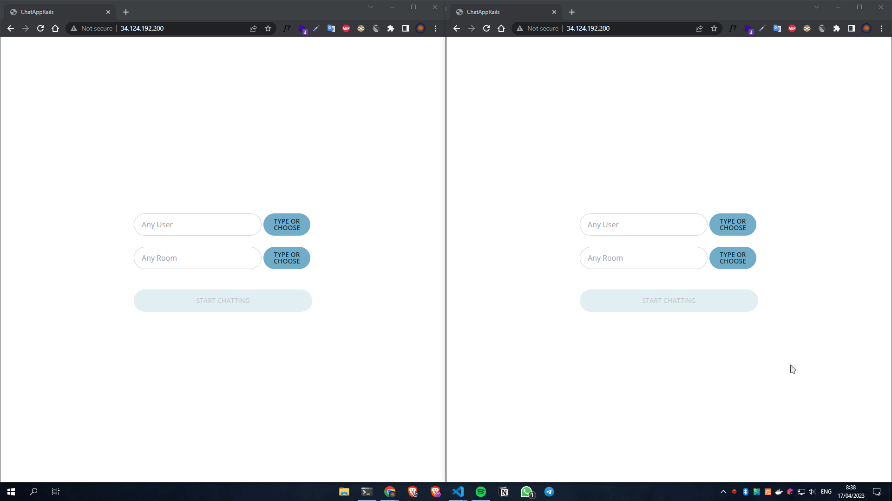

# Simple chat app using Rails 7

# Demo

Things I should cover:

* Ruby version

* System dependencies

* Configuration

* Database creation

* Database initialization

* How to run the test suite

* Services (job queues, cache servers, search engines, etc.)

* Deployment instructions

* ...

## License

This project is released under the [MIT License](LICENSE).
